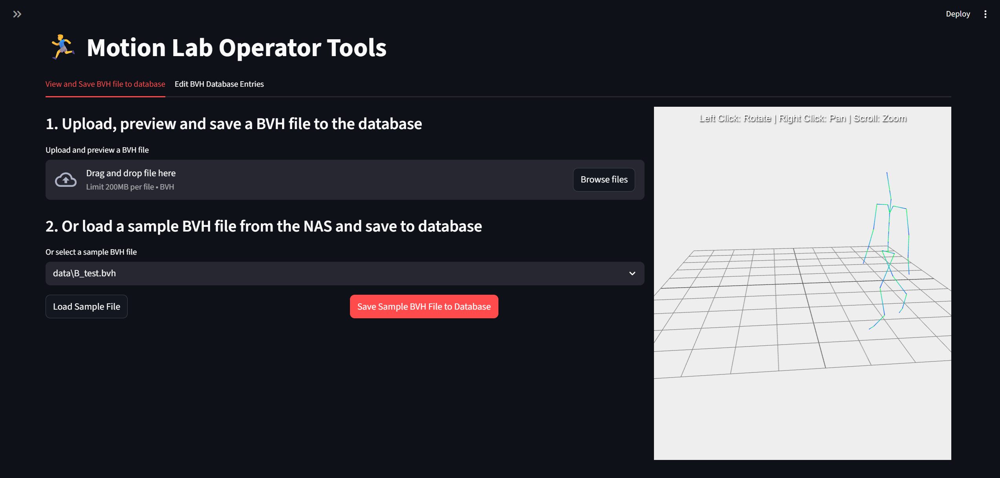
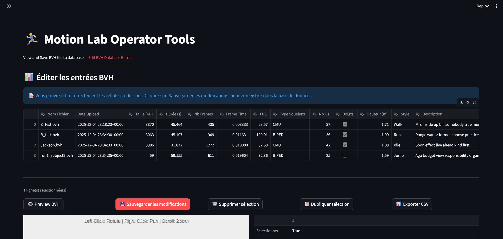

# How to run the project
Use Docker to run the project easily without worrying about dependencies.

```bash
docker compose -f src/docker-compose.yml -p igr3d up -d
```

* Streamlit app will be available at: [http://localhost:8503/](http://localhost:8503/)
* pgAdmin will be available at: [http://localhost:8888/](http://localhost:8888/)
  * See the `.env` file for the default username and password.
* PostGIS database will be available at: `localhost:5433`
  * See the `.env` file for the default database name, username, and password.

### Local development setup

If you want to run the project locally without Docker, follow these steps:
1. **Set up a Python virtual environment.**
   Open a command prompt (cmd) or PowerShell and run:

   ```bash
   # Create a virtual environment
   python -m venv .venv
   
   # Activate the virtual environment
   .venv\Scripts\activate
   ```
2.   Once the virtual environment is activated, install the required packages:

   ```bash
   pip install -r src/requirements.txt
   ```
3. Run the Streamlit application:

   ```bash
   streamlit run src/main.py
   ```

## Screenshots

